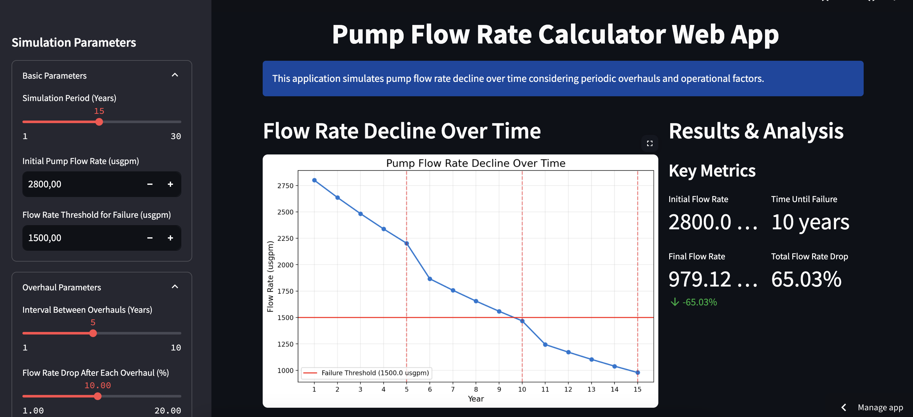

# Pump Flow Rate Calculator

A Streamlit application for simulating and visualizing pump flow rate decline over time with consideration for periodic overhauls and operational factors.



## Description

This application helps engineers and maintenance personnel predict pump performance degradation over time based on various operational parameters. It simulates how factors such as sand particle concentration, pH levels, and overhaul intervals affect the flow rate of pumps, allowing for better maintenance planning and operational decision-making.

## Features

- **Interactive Parameter Controls**: Easily adjust all simulation parameters through intuitive sliders and input fields
- **Visual Flow Rate Analysis**: Graphical representation of pump flow rate decline over the simulation period
- **Operational Impact Visualization**: Bar charts showing the relative impact of different operational factors
- **Detailed Data Table**: Year-by-year breakdown of flow rates and overhaul events
- **Smart Recommendations**: Contextual advice based on simulation results
- **Data Export**: Download simulation results as CSV for further analysis
- **Failure Prediction**: Automatic calculation of expected time until the pump reaches failure threshold

## Installation

1. Clone this repository:
   ```bash
   git clone https://github.com/yourusername/pump-flow-calculator.git
   cd pump-flow-calculator
   ```

2. Install the required packages:
   ```bash
   pip install -r requirements.txt
   ```

3. Run the Streamlit app:
   ```bash
   streamlit run app.py
   ```

## Requirements

- Python 3.7+
- Streamlit
- NumPy
- Matplotlib
- Pandas

A complete list of dependencies can be found in `requirements.txt`.

## Usage

1. **Set Simulation Parameters**:
   - Adjust the simulation period, initial flow rate, and failure threshold
   - Configure overhaul frequency and impact
   - Set operational factors like sand particle concentration and pH level

2. **Analyze Results**:
   - View the flow rate decline graph
   - Check the year-by-year data table
   - Review key metrics and predictions
   - Consider recommendations based on the simulation

3. **Export Data**:
   - Download the simulation results as a CSV file for record-keeping or further analysis

## Parameter Explanations

- **Simulation Period**: Total number of years to simulate (1-30 years)
- **Initial Flow Rate**: Starting pump flow rate in USGPM (US Gallons Per Minute)
- **Flow Rate Threshold for Failure**: Minimum acceptable flow rate before the pump is considered failed
- **Overhaul Interval**: Number of years between scheduled maintenance overhauls
- **Flow Rate Drop After Overhaul**: Percentage decrease in maximum flow rate after each overhaul
- **Sand Particle Concentration**: Percentage of sand particles in the pumped fluid
- **pH Level**: Acidity/alkalinity of the pumped fluid (7 is neutral)

## How It Works

The simulation uses an exponential decay model that accounts for:

1. **Periodic Overhauls**: Fixed percentage drop in maximum flow rate after each overhaul
2. **Particle Erosion**: Continuous degradation based on sand particle concentration
3. **Chemical Effects**: Degradation based on deviation from neutral pH

The flow rate for each year is calculated using:
- Initial flow rate reduction from overhauls
- Exponential decay due to operational factors (particles and pH)

## Contributing

Contributions are welcome! Please feel free to submit a Pull Request.

1. Fork the repository
2. Create your feature branch (`git checkout -b feature/AmazingFeature`)
3. Commit your changes (`git commit -m 'Add some AmazingFeature'`)
4. Push to the branch (`git push origin feature/AmazingFeature`)
5. Open a Pull Request

## License

This project is licensed under the MIT License - see the LICENSE file for details.

## Acknowledgments

- Original algorithm developed for industrial pump maintenance prediction
- Built with Streamlit for interactive data applications